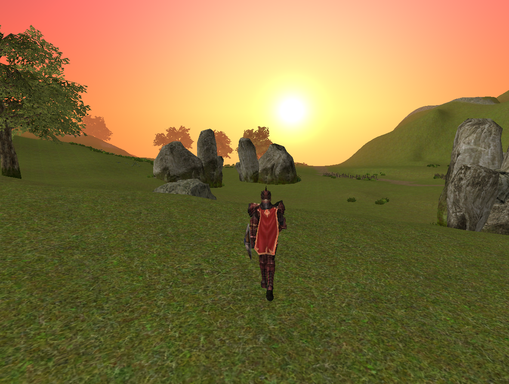

<p align="center">
  
</p>

<p align="center"><em>But one day, tiny flames will dance across the darkness</em></p>

# Phoenix Engine

Phoenix Engine is an open source MMO engine focused on high performance, modular features, and ease of use. It uses Vulkan as its graphics API and runs on Windows and Linux.

The project is still in its infancy. Today it provides a gameplay/preview mode, not a full client and not a server component yet. The repository contains engine/source code only; game data and commercial assets are not included.

## Project Goals

Phoenix Engine has two long-term goals:

- A modern, highly optimized, and visually appealing MMO client.
- A portable and flexible codebase that can be used to create MMO games.

The immediate goal is to render classic client content correctly, matching the native game where it matters and improving it where modern rendering can do better. That includes maps, characters, mantles, weapons, shields, monsters, NPCs, vehicles, and related world content.

Phoenix Engine also aims to modernize older visual and technical systems over time. Sky and water rendering are already custom systems instead of direct native-format reproductions. The project should remain modular, understandable, and practical to develop across a long timeline. Eventually, legacy data formats should be converted into modern formats without losing their original properties.

The current runtime is designed to be easy to test through a playable character mode and a free-view camera mode.

## Roadmap

Phase one is focused on engine foundations:

- Render supported client content accurately and efficiently.
- Improve outdated visuals with modern systems where appropriate.
- Keep the architecture modular and friendly to contributors.
- Build a path for converting legacy formats into modern equivalents.

Phase two begins once the initial rendering and gameplay-preview goals are covered:

- Transform the gameplay module into a proper client ready for server logic and server-side parameters.
- Recreate a defined suite of content up to a fixed episode, creating a stable base for future work.

Phoenix Engine does not assume deep technical knowledge from final users. Everyone is welcome to test, report issues, document behavior, and contribute where they can. This is intentionally a long-term project.

## Current Features

- Vulkan renderer with terrain, objects, water, fog, and procedural sky.
- Runtime skinning for character animations with frame caching for high FPS (GPU compute path + CPU fallback).
- WLD/DG map loading with free-camera viewer mode and playable character mode.
- Character appearance loading with race, armor, face, hair, weapon, shield, and mantle selection.
- Per-race/class weapon and shield attach-bone mapping, with a default starting loadout (one-hand sword + light shield + mantle).
- Mounts/vehicles: ride seated on the mount's bone, mount animations, and faster-than-foot movement.
- Procedural weapon "aura" effects: fully shader-generated layered particles (no asset files) with birth-to-death colour gradients and element presets (fire, ice, holy, poison, shadow, arcane).
- NPC and monster loading from server/map data with nameplates, scale, idle/walk animation, and distance culling.
- CSV-based data formats replacing legacy binary formats for monster definitions, NPC data, server metadata, and spawn maps (see [Data Formats](#data-formats)).
- Terrain-based footstep sounds: the engine reads walkSound from terrain layers and plays the matching sound effect when the character walks or runs.
- Map ambience support for music and sound zones with distance-based fade behavior (OGG Vorbis via miniaudio).
- Water surface rendering, underwater tinting, swimming, floating, and camera-driven movement.
- Emote animations (one-shot, 10 slots) triggered from the editor panel.
- ImGui runtime controls for map selection, fog, render distance, actor distance, overlays, character/loadout selection, weapon aura, and sky/weather styles, plus a CPU/RAM/VRAM performance HUD.
- Procedural sky styles: default, storm, snowstorm, sunset, and night with stars/moon/meteors.

## Repository Layout

```text
src/
  app/       Application setup helpers.
  assets/    Data indexing and path resolution.
  audio/     Audio playback via miniaudio (OGG Vorbis).
  character/ Playable character controller and character mesh assembly.
  core/      Logging.
  effects/   Particle effect placement.
  runtime/   Engine runtime state, map loading, terrain/object scene building.
  platform/  SDL2 window/input wrapper.
  renderer/  Vulkan renderer (split by subsystem), texture loading, GPU resources.
  ui/        ImGui editor panel, performance HUD, loading screen.
  world/     File format loaders.
shaders/     HLSL source and compiled SPIR-V used by the runtime.
res/         Windows icon/resource files.
external/    Vendored third-party dependencies.
scripts/     Helper scripts for building and shader compilation.
docs/        Public documentation and release notes.
```

## Supported Platforms

| Platform | Status | Build System |
|----------|--------|-------------|
| Windows 10/11 | Primary | Visual Studio 2022 / MSBuild |
| Linux (X11/Wayland) | Supported | CMake + GCC/Clang |

Both platforms share the same codebase. The platform layer uses SDL2, the renderer uses Vulkan through volk, and the audio system uses miniaudio with stb_vorbis.

## Requirements

### Windows

- Visual Studio 2022 Build Tools with MSVC v143.
- Windows SDK.
- CMake 3.20+ installed on `PATH`.
- A Vulkan-capable GPU and current graphics driver.

SDL2 is vendored in the repository.

### Linux

- GCC 13+ or Clang 17+ (C++23 required).
- CMake 3.20+ installed on `PATH`.
- SDL2 development libraries.
- Vulkan-capable GPU and driver with ICD loader (Vulkan headers are vendored).

Install dependencies on Debian/Ubuntu:

```bash
sudo apt install build-essential cmake pkg-config libsdl2-dev libvulkan1 mesa-vulkan-drivers
```

On Fedora:

```bash
sudo dnf install gcc-c++ cmake pkgconf SDL2-devel vulkan-loader mesa-vulkan-drivers
```

On Arch:

```bash
sudo pacman -S base-devel cmake pkgconf sdl2 vulkan-icd-loader
```

## Build

### Windows

From the repository root in PowerShell:

```powershell
cmake -S . -B build/windows-vs2022-x64 -G "Visual Studio 17 2022" -A x64
cmake --build build/windows-vs2022-x64 --config Release
```

Output: `bin\x64\Release\PhoenixEngine.exe`

### Linux

```bash
cmake -S . -B build/linux-release -DCMAKE_BUILD_TYPE=Release
cmake --build build/linux-release -j$(nproc)
```

Output: `build/linux-release/PhoenixEngine`

The repository vendors Vulkan Headers, volk, Dear ImGui, and DXC binaries used for shader compilation. A full Vulkan SDK install is not required for this project layout, but CMake must be installed separately.

## Shader Compilation

Compiled shader binaries are stored in `shaders/compiled/` because the runtime loads SPIR-V at startup.

To recompile shaders (Windows):

```powershell
.\scripts\compile_shaders.ps1
```

On Linux, use any HLSL-to-SPIR-V compiler (e.g. `dxc` from the Vulkan SDK):

```bash
dxc -spirv -T vs_6_0 -E VSMain -Fo shaders/compiled/sky.vert.spv shaders/sky.hlsl
dxc -spirv -T ps_6_0 -E PSMain -Fo shaders/compiled/sky.frag.spv shaders/sky.hlsl
```

Pre-compiled SPIR-V is checked into the repository, so shader recompilation is only needed when modifying shader source.

## Runtime Data

Phoenix Engine resolves runtime data from the first valid location in this order:

1. `PHOENIX_ENGINE_DATA` environment variable.
2. `Data/` next to the executable.
3. `Data/` in the current working directory.
4. `Data/` in parent directories above the executable, useful for source-tree development.

Platform-specific fallback locations:

| Platform | Paths |
|----------|-------|
| Windows | `%LOCALAPPDATA%/Phoenix Engine/Data`, `%PROGRAMDATA%/Phoenix Engine/Data` |
| Linux | `~/.local/share/Phoenix Engine/Data` |

For quick local development, the recommended layout is:

```text
Phoenix Engine/Data/
```

The code references formats such as `.wld`, `.dg`, `.smod`, `.3dc`, `.ani`, and `.dds`. These files are user-supplied and are intentionally excluded from the repository.

See [docs/ASSETS.md](docs/ASSETS.md) for more details.

## Usage

1. Keep the `Data/` folder in one of the supported runtime data locations.
2. Launch Phoenix Engine.
3. Use playable mode or free-view mode to explore and test maps.

## Controls

- `W/A/S/D`: move.
- `Space`: jump (playable mode) / raise camera (viewer mode).
- Right mouse drag: camera look.
- Mouse wheel: zoom in playable mode or move camera in viewer mode.
- `Shift`: faster movement.
- `P`: toggle playable mode.
- ImGui panel: map loading, fog, distances, overlays, audio toggles, character/loadout selection, mount, weapon aura, and weather/sky style.

## World CSV Format

Each world directory (`Data/World/worldN/`) contains:

| File | Content |
|------|---------|
| `map.csv` | Map properties: size, dungeon flag, DG file reference. |
| `heightmap.raw` | Terrain height samples (16-bit, binary). |
| `texturemap.raw` | Per-vertex terrain layer indices (8-bit, binary). |
| `terrain_layers.csv` | Terrain texture layers with tile size and walk sound. |
| `sky.csv` | Sky texture, cloud layers, fog color and distances. |
| `objects.csv` | All placed objects (category, asset file, position, orientation). |
| `portals.csv` | Map transition zones with destination coordinates. |
| `audio.csv` | Music zones and ambient sound emitters. |

Audio references (originally `.wav`) are resolved to `.ogg` (Vorbis) files on disk. Texture references (`.tga`, `.bmp`) are resolved to `.dds` when available.

The engine also loads the original WLD, DG, 3DC, SMOD, and ANI binary formats for world geometry, models, and animations.

## License

BSD 3-Clause License

Copyright (c) 2025-2026, Phoenix Engine contributors. All rights reserved.

Redistribution and use in source and binary forms, with or without modification, are permitted provided that the following conditions are met:

1. Redistributions of source code must retain the above copyright notice, this list of conditions and the following disclaimer.
2. Redistributions in binary form must reproduce the above copyright notice, this list of conditions and the following disclaimer in the documentation and/or other materials provided with the distribution.
3. Neither the name of the copyright holder nor the names of its contributors may be used to endorse or promote products derived from this software without specific prior written permission.

THIS SOFTWARE IS PROVIDED BY THE COPYRIGHT HOLDERS AND CONTRIBUTORS "AS IS" AND ANY EXPRESS OR IMPLIED WARRANTIES, INCLUDING, BUT NOT LIMITED TO, THE IMPLIED WARRANTIES OF MERCHANTABILITY AND FITNESS FOR A PARTICULAR PURPOSE ARE DISCLAIMED. IN NO EVENT SHALL THE COPYRIGHT HOLDER OR CONTRIBUTORS BE LIABLE FOR ANY DIRECT, INDIRECT, INCIDENTAL, SPECIAL, EXEMPLARY, OR CONSEQUENTIAL DAMAGES (INCLUDING, BUT NOT LIMITED TO, PROCUREMENT OF SUBSTITUTE GOODS OR SERVICES; LOSS OF USE, DATA, OR PROFITS; OR BUSINESS INTERRUPTION) HOWEVER CAUSED AND ON ANY THEORY OF LIABILITY, WHETHER IN CONTRACT, STRICT LIABILITY, OR TORT (INCLUDING NEGLIGENCE OR OTHERWISE) ARISING IN ANY WAY OUT OF THE USE OF THIS SOFTWARE, EVEN IF ADVISED OF THE POSSIBILITY OF SUCH DAMAGE.
